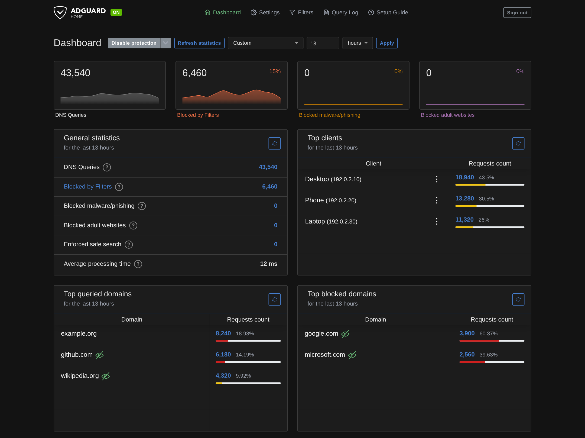
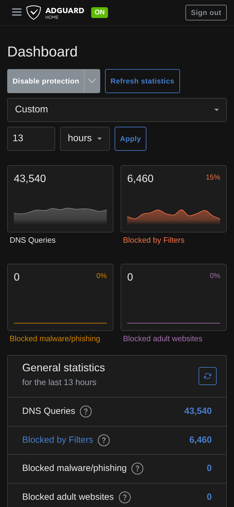

# AdGuard Home Patcher

[](https://github.com/rdna897/adguardhome-patcher/actions/workflows/build.yml)

AdGuard Home Patcher adds frontend-only dashboard improvements to the official AdGuard Home binary or Docker image. It does not modify the AdGuard Home backend, configuration, statistics database, or server Query Log.

## Features

### Dashboard time ranges

- **Default**, **Last 1 / 6 / 12 / 24 hours**, **Today**, **Last 7 days**, **Last 30 days**, and **Custom** hour/day ranges.
- The selected range persists in the browser.
- Statistics use the existing AdGuard Home statistics API; no backend or binary patch is required.
- Ranges longer than the configured statistics retention period are disabled.
- **Today** starts at local midnight in the browser's time zone.
- Hourly ranges include the current partial hour and preceding full hours.
- A single bucket is rendered as a flat series with the same hourly tooltip at both ends.
- Compact two-column statistics charts on phone-sized screens.

### Live Query Log

- **Start Live View / Pause Live View** actions on the existing Query Log page, with the preference retained in the browser.
- Live mode polls the existing Query Log API roughly one second after each completed request; there is no WebSocket, backend push stream, or modified AdGuard Home binary.
- Existing domain/client search and response-status filters continue to work in Live mode.
- New DNS requests appear automatically while you remain at the newest entries.
- Scrolling away from the top freezes the visible rows so troubleshooting history does not move underneath you.
- Incoming entries are queued behind a **new queries — Show newest** action while you read older rows.
- **Show newest** returns to and reveals the newest entries; naturally scrolling back to the top also reveals queued arrivals.
- Client block/unblock row actions preserve queued arrivals and their pending indicator.
- **Clear view** is a secondary action available during Live mode. Its tooltip and screen-reader description explain that it clears only the displayed browser Live View and keeps the server Query Log/history.
- Hidden tabs suspend polling and resume safely when visible again.
- Request failures retain the current rows and retry after a five-second back-off.
- The browser keeps at most **500 displayed rows plus 500 queued arrivals**.
- Normal paused Query Log refresh and pagination remain available.
- Desktop and mobile layouts are covered by production-browser validation.

Live Query Log is deliberately a lightweight troubleshooting view rather than a lossless server-pushed stream. Each poll reads up to 100 newest matching records. Bursts exceeding that page size between polls, long request gaps, or time spent in a hidden tab can leave gaps in the live browser view. The authoritative server Query Log remains available through normal paused browsing and **Refresh**. See the [desktop and mobile control screenshots](docs/live-query-log-controls.md).

## Screenshots

The screenshots show a custom 13-hour range with sample statistics. `google.com` and `microsoft.com` are example blocked domains.

**Desktop**



**Mobile**



The mobile screenshot shows one visible screen. Scroll down in the dashboard to see the client and domain tables.

## How it works

GitHub Actions checks for the newest stable AdGuard Home release every six hours. It applies the frontend patch and runs validation regression checks, applied-source whitespace checks, type checking, lint, frontend tests, a production build, browser validation, and a smoke test against the official AdGuard Home binary. Successful builds are published as `ui-vX.Y.Z`; compatibility failures create an `incompatible` issue.

Pull requests to `main` validate the exact PR head with read-only permissions. The PR path does not publish releases, modify issues, or receive write-capable checkout credentials. Trusted release/publish jobs remain restricted to this repository's `main` branch and trusted push, schedule, or manual events.

On a Linux host, a systemd timer checks every 15 minutes for UI assets matching the installed native binary or running Docker container. Downloads are SHA-256 verified. The launcher enables `--local-frontend` only when `build/VERSION` matches the AdGuard Home binary; otherwise AdGuard Home starts with its stock dashboard.

## Download the installer (no Git required)

For either native or Docker installation, download the repository archive on your **Linux host**. On Debian/Ubuntu:

```sh
sudo apt update
sudo apt install -y curl ca-certificates tar
patcher_archive=$(mktemp)
curl -fL --retry 2 https://github.com/rdna897/adguardhome-patcher/archive/refs/heads/main.tar.gz \
  -o "$patcher_archive"
sudo mkdir -p /opt/adguardhome-patcher
sudo tar -xzf "$patcher_archive" --strip-components=1 -C /opt/adguardhome-patcher
rm -f "$patcher_archive"
```

Then follow the native or Docker steps below. Extracting this archive also works over an existing patcher installation and preserves its downloaded `ui/` directory. Git is needed only if you want to develop or build the patch yourself.

## Native installation

These instructions add the patched dashboard to an **existing native AdGuard Home installation on Linux with systemd**. For installing AdGuard Home itself, follow the official AdGuard Home getting-started documentation.

The default binary directory is `/opt/AdGuardHome`, and the service is `AdGuardHome.service`. After downloading the installer above, run:

```sh
sudo sh /opt/adguardhome-patcher/install/native/install.sh
```

For a different binary directory:

```sh
sudo env AGH_DIR=/your/AdGuardHome sh /opt/adguardhome-patcher/install/native/install.sh
```

The installer copies the launcher beside the binary, installs the sync script, writes `/etc/default/agh-ui-sync`, adds a systemd override preserving the service's startup arguments, and enables `agh-ui-sync.timer`. It can be run again to update the installed scripts.

Check the installation or sync immediately:

```sh
sudo journalctl -u AdGuardHome -n 30 --no-pager
systemctl list-timers agh-ui-sync.timer
sudo /usr/local/bin/agh-ui-sync.sh
```

For a native installation without systemd, use `scripts/agh-launch.sh` as the service wrapper with `AGH_BIN` and `AGH_UI_ROOT` set to absolute paths. Run `scripts/agh-ui-sync.sh` from your scheduler with `MODE=native`, `AGH_DIR`, and `RESTART_CMD` set for your service manager. The packaged installers and timers target Linux/systemd.

## Docker installation

Use the official `adguard/adguardhome` image and retain your existing **work/configuration volumes, ports, networking, and other required command flags**. The host runs the downloader; the container receives a read-only UI directory and launcher. The container does not need download tools or Docker socket access.

The following assumes Docker Compose on a Linux host with systemd, an existing container named `adguardhome`, and a Compose service named `adguardhome`.

### 1. Install the host sync

After downloading the installer above, run on the Docker host:

```sh
sudo sh /opt/adguardhome-patcher/install/docker/install.sh adguardhome
```

Replace the final `adguardhome` with your container name. The script reads that container's version, prepares `/opt/adguardhome-patcher/ui`, installs the launcher at `/usr/local/lib/adguardhome-patcher/agh-launch.sh`, and enables the host sync timer.

### 2. Add the dashboard override

From the directory containing your existing Compose file:

```sh
sudo docker compose -f compose.yaml \
  -f /opt/adguardhome-patcher/install/docker/compose.override.yaml \
  up -d adguardhome
```

Use your actual Compose filename. If the service name differs, edit the service key in the override and use that name in the command. The override preserves the base image, volumes, ports, and networking while changing the working directory/startup wrapper. Retain any additional command flags required by your installation.

The override mounts the **parent UI directory**, allowing later atomic UI replacements to become visible inside the container. The launcher verifies the running binary version before enabling the patched dashboard.

A minimal base Compose example for a new installation is:

```yaml
services:
  adguardhome:
    image: adguard/adguardhome:latest
    container_name: adguardhome
    restart: unless-stopped
    ports:
      - "53:53/tcp"
      - "53:53/udp"
      - "3000:3000/tcp"
      - "8080:80/tcp"
    volumes:
      - ./work:/opt/adguardhome/work
      - ./conf:/opt/adguardhome/conf
```

Start the base file, finish AdGuard Home setup on port 3000, then apply the two steps above. Port 8080 maps the dashboard when AdGuard Home listens on container port 80. Add encrypted-DNS or DHCP ports as required. Existing installations should always reuse their existing data paths.

Check the installation:

```sh
sudo docker logs --tail 30 adguardhome
systemctl list-timers agh-ui-sync.timer
sudo /usr/local/bin/agh-ui-sync.sh
```

Look for `agh-launch: using patched dashboard UI for vX.Y.Z`. One host sync configuration targets one native service or one Docker container.

## Updates

### Update the patched dashboard

For an existing native or Docker installation, run this on the **Linux host**:

```sh
sudo /usr/local/bin/agh-ui-sync.sh
```

The sync script downloads the newest UI build matching your installed AdGuard Home version, verifies its SHA-256 checksum, and restarts the service or container if the build changed. It uses `/etc/default/agh-ui-sync` to select your installation. The timer also checks automatically every 15 minutes; an already-current build exits without restarting.

Hard-refresh the dashboard after an update. On mobile, close and reopen the tab if it still shows the old UI. A dashboard-only update does not require reinstalling AdGuard Home or pulling a new Docker image.

### Update the host scripts

Repeat **Download the installer (no Git required)** above to replace the patcher's files, then rerun the installer for your existing installation:

```sh
# Native: use the same AGH_DIR as your original installation, if customized.
sudo sh /opt/adguardhome-patcher/install/native/install.sh
# Or Docker: use your existing container name.
sudo sh /opt/adguardhome-patcher/install/docker/install.sh adguardhome
```

Run only the command for your installation. If you customized the Compose override, retain those settings when downloading the new files; the archive replaces the supplied override. AdGuard Home data volumes and the downloaded `ui/` directory are preserved.

### Update AdGuard Home

Update native AdGuard Home normally. If the binary version changes before a matching patched UI exists, the launcher safely uses the stock UI until the timer obtains a compatible build.

For Docker, pull and recreate the service using **both Compose files**:

```sh
sudo docker compose -f compose.yaml \
  -f /opt/adguardhome-patcher/install/docker/compose.override.yaml pull adguardhome
sudo docker compose -f compose.yaml \
  -f /opt/adguardhome-patcher/install/docker/compose.override.yaml up -d adguardhome
sudo /usr/local/bin/agh-ui-sync.sh
```

Update the image tag in the base file first if you pin versions. Refresh the browser after a dashboard update.

If a build is missing for an older supported AdGuard Home version, use **Actions → build → Run workflow** with that version tag.

## Uninstall

For a native installation:

```sh
sudo sh /opt/adguardhome-patcher/install/native/uninstall.sh
```

Use `sudo env AGH_DIR=/your/AdGuardHome sh ...` if installed elsewhere. This removes the service override, sync timer, launcher, and downloaded UI, then restarts the stock service.

For Docker, first recreate the container with the **base Compose file only** so the original entrypoint is restored:

```sh
sudo docker compose -f compose.yaml up -d --force-recreate adguardhome
sudo sh /opt/adguardhome-patcher/install/docker/uninstall.sh
```

Work and configuration volumes are retained. After removing the patcher mounts, the downloaded UI and launcher files can also be deleted if no longer required.

## Building and validation

The current patch base is defined by `patch/PATCH_BASE`. Building requires Node.js 22, Python 3, git, curl, tar, and sudo when the smoke test needs elevated permissions.

```sh
scripts/build-release.sh v0.107.79
```

For the complete browser-inclusive gate:

```sh
BROWSER_TEST=1 scripts/build-release.sh v0.107.79
```

The gate verifies patch application, validation regressions, staged and unstaged applied-source whitespace, type checking, lint, frontend tests, production webpack output, desktop/mobile Live Query Log behaviour, and the official AdGuard Home binary smoke test. Release output includes the patched UI archive and checksum plus a corresponding source archive containing the patched upstream source, licence, patch, and build/install scripts.

Browser validation covers action names, keyboard activation/focus, persisted Live preferences, browser-only clearing, singular/plural pending actions, and control spacing at 1440, 390, and 320 pixels wide, alongside the existing polling/state regressions. Set `LIVE_LOG_SCREENSHOT_DIR=/path/to/screenshots` when running the browser-inclusive gate to save viewport captures of inactive, Live, and queued-query states.

To edit the frontend patch:

```sh
git clone --depth 1 --branch "$(cat patch/PATCH_BASE)" https://github.com/AdguardTeam/AdGuardHome.git agh
cd agh
git apply ../patch/dashboard-range.patch
# Edit client/..., then:
git add -N client
git diff --binary -- client ':!client/node_modules' > ../patch/dashboard-range.patch
```

Blank unified-patch context lines require a space, so `patch/dashboard-range.patch` has a narrowly scoped `blank-at-eol` exemption. The build independently checks both staged and unstaged **applied source** with Git's trailing-space, blank-EOF, and space-before-tab checks. Regression tests verify malformed applied source fails validation.

## Licence

[GPL-3.0](LICENSE), matching AdGuard Home. This project modifies the frontend and is not an official AdGuard product. Upstream copyright notices are preserved in the source archives.
