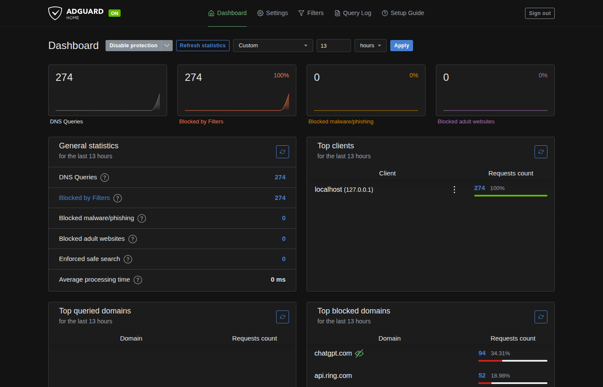

# AdGuard Home Patcher

[](https://github.com/rdna897/adguardhome-patcher/actions/workflows/build.yml)

Add a time range selector to the AdGuard Home dashboard: **Default**, **Last 1 / 6 / 12 / 24 hours**, **Today**, **Last 7 days**, **Last 30 days**, and **Custom** hours or days. The selection stays in your browser. Phone screens use a compact two-column chart layout.



The patch runs with the official AdGuard Home binary or Docker image. It changes the frontend only; your configuration, statistics database, and query log stay intact.

## How it works

GitHub Actions checks for the newest stable AdGuard Home release every six hours. It applies the patch, runs type checking, lint, unit tests, a production build, and a smoke test against the official binary. Successful builds are published as `ui-vX.Y.Z`; failures create an `incompatible` issue.

On your Linux host, a systemd timer checks every 15 minutes for the UI matching the installed binary or running container. It verifies the download's SHA-256 checksum, installs it, and restarts AdGuard Home when the UI changes. The launcher enables `--local-frontend` only when `build/VERSION` matches the binary. Otherwise, it starts the stock dashboard.

## Native installation

These instructions add the dashboard to an **existing native AdGuard Home installation on Linux with systemd**. For installing AdGuard Home itself, follow the [official getting-started guide](https://adguard-dns.io/kb/adguard-home/getting-started/).

The default binary directory is `/opt/AdGuardHome`, and the service is `AdGuardHome.service`. On Debian/Ubuntu, run:

```sh
sudo apt update
sudo apt install -y git curl ca-certificates
sudo git clone https://github.com/rdna897/adguardhome-patcher.git /opt/adguardhome-patcher
sudo sh /opt/adguardhome-patcher/install/native/install.sh
```

For a different binary directory:

```sh
sudo env AGH_DIR=/your/AdGuardHome sh /opt/adguardhome-patcher/install/native/install.sh
```

The installer copies the launcher beside the binary, installs the sync script, writes `/etc/default/agh-ui-sync`, adds a systemd override preserving the service's startup arguments, and enables `agh-ui-sync.timer`. It can be run again to update the installed scripts.

Check the installation or sync immediately:

```sh
sudo journalctl -u AdGuardHome -n 30 --no-pager
systemctl list-timers agh-ui-sync.timer
sudo /usr/local/bin/agh-ui-sync.sh
```

For a native installation without systemd, use `scripts/agh-launch.sh` as the service wrapper with `AGH_BIN` and `AGH_UI_ROOT` set to absolute paths. Run `scripts/agh-ui-sync.sh` from your scheduler with `MODE=native`, `AGH_DIR`, and `RESTART_CMD` set for your service manager. The packaged installers and timers target Linux/systemd.

## Docker installation

Use the official `adguard/adguardhome` image and keep your existing **work and configuration volumes, ports, and network settings**. The host runs the downloader; the container gets a read-only UI directory and the launcher. The container needs no download tools or Docker socket access. See the [official Docker documentation](https://adguard-dns.io/kb/adguard-home/docker/) for the image's standard paths and ports.

The following steps assume Docker Compose on a Linux host with systemd, an existing running container named `adguardhome`, and a Compose service named `adguardhome`.

### 1. Install the host sync

```sh
sudo apt update
sudo apt install -y git curl ca-certificates
sudo git clone https://github.com/rdna897/adguardhome-patcher.git /opt/adguardhome-patcher
sudo sh /opt/adguardhome-patcher/install/docker/install.sh adguardhome
```

Replace the final `adguardhome` with your container name. The script reads the version from that container, prepares `/opt/adguardhome-patcher/ui`, installs the launcher at `/usr/local/lib/adguardhome-patcher/agh-launch.sh`, and enables the host sync timer.

### 2. Add the dashboard override

From the directory containing your existing Compose file:

```sh
sudo docker compose -f compose.yaml \
  -f /opt/adguardhome-patcher/install/docker/compose.override.yaml \
  up -d adguardhome
```

Use your actual Compose filename. If the service has a different name, edit the `adguardhome` service key in the override and use that service name in the command. The override preserves the base file's image, volumes, ports, and networking, while changing the working directory and startup wrapper. It sets the official configuration and work paths explicitly; retain any additional command flags you already use.

The override mounts the **parent UI directory**, so later atomic UI replacements are visible inside the container. The launcher checks the running binary's version before enabling the patched dashboard.

For a new installation, a minimal base Compose file is:

```yaml
services:
  adguardhome:
    image: adguard/adguardhome:latest
    container_name: adguardhome
    restart: unless-stopped
    ports:
      - "53:53/tcp"
      - "53:53/udp"
      - "3000:3000/tcp"
      - "8080:80/tcp"
    volumes:
      - ./work:/opt/adguardhome/work
      - ./conf:/opt/adguardhome/conf
```

Start that base file, finish AdGuard Home setup on port 3000, then follow the two steps above. Port 8080 maps the dashboard when AdGuard Home is configured to listen on container port 80. Add the ports you need for encrypted DNS or DHCP following the official documentation. When adapting an existing installation, reuse its data paths instead of creating new empty directories.

If you use `docker run`, install the host sync first, then recreate the container with the launcher. The following example assumes you have already stopped and removed the old container while retaining its data. Replace the two data paths and preserve any additional ports and network options from your original command:

```sh
sudo docker run -d --name adguardhome --restart unless-stopped \
  -p 53:53/tcp -p 53:53/udp -p 3000:3000/tcp -p 8080:80/tcp \
  -v /your/work:/opt/adguardhome/work \
  -v /your/conf:/opt/adguardhome/conf \
  -v /usr/local/lib/adguardhome-patcher/agh-launch.sh:/opt/adguardhome-patcher/agh-launch.sh:ro \
  -v /opt/adguardhome-patcher/ui:/opt/adguardhome/ui:ro \
  -w /opt/adguardhome/ui \
  -e AGH_BIN=/opt/adguardhome/AdGuardHome \
  -e AGH_UI_ROOT=/opt/adguardhome/ui \
  --entrypoint /bin/sh adguard/adguardhome:latest \
  /opt/adguardhome-patcher/agh-launch.sh --no-check-update \
  -c /opt/adguardhome/conf/AdGuardHome.yaml -w /opt/adguardhome/work
```

Check the installation:

```sh
sudo docker logs --tail 30 adguardhome
systemctl list-timers agh-ui-sync.timer
sudo /usr/local/bin/agh-ui-sync.sh
```

Look for `agh-launch: using patched dashboard UI for vX.Y.Z`. One host sync configuration targets one native service or one Docker container.

## Updates

Update native AdGuard Home with your usual method. On the next service start, the launcher uses the stock UI if the binary version has changed; the timer installs a matching dashboard when available.

For Docker, pull and recreate the container using **both Compose files**:

```sh
sudo docker compose -f compose.yaml \
  -f /opt/adguardhome-patcher/install/docker/compose.override.yaml pull adguardhome
sudo docker compose -f compose.yaml \
  -f /opt/adguardhome-patcher/install/docker/compose.override.yaml up -d adguardhome
sudo /usr/local/bin/agh-ui-sync.sh
```

Update the image tag in your base file first if you pin a version. The launcher and timer handle the UI version independently. Refresh the browser after a dashboard update.

To update the host scripts, update your checkout and rerun the appropriate installer. If a build is missing for an older AdGuard Home version, run **Actions → build → Run workflow** with that version's tag.

## Uninstall

For a native installation:

```sh
sudo sh /opt/adguardhome-patcher/install/native/uninstall.sh
```

Use `sudo env AGH_DIR=/your/AdGuardHome sh ...` if you installed into another binary directory. This removes the service override, sync timer, launcher, and downloaded UI, then restarts the stock service.

For Docker, first recreate the container with the **base Compose file only**, explicitly forcing recreation to restore the original entrypoint:

```sh
sudo docker compose -f compose.yaml up -d --force-recreate adguardhome
sudo sh /opt/adguardhome-patcher/install/docker/uninstall.sh
```

Your work and configuration volumes are retained. The host UI and launcher files remain available for reuse; after removing their mounts, you can delete `/opt/adguardhome-patcher/ui` and `/usr/local/lib/adguardhome-patcher` if you no longer need them.

## Time ranges

- Statistics use hourly buckets: **Last 1 hour** is the current partial hour; longer hourly ranges include it and the preceding full hours.
- A single bucket is drawn flat with the same hourly tooltip at both ends.
- **Today** starts at local midnight in the browser's time zone.
- Ranges longer than your statistics retention setting are disabled.
- Absolute start/end ranges require backend changes and are not included.
- The range selector uses English strings added at runtime.

## Building and changing the patch

Requires Node.js 22, git, curl, tar, and sudo when the smoke test needs elevated permissions.

```sh
scripts/build-release.sh v0.107.79
```

To edit the frontend patch:

```sh
git clone --depth 1 --branch "$(cat patch/PATCH_BASE)" https://github.com/AdguardTeam/AdGuardHome.git agh
cd agh
git apply ../patch/dashboard-range.patch
# Edit client/..., then:
git add -N .
git diff > ../patch/dashboard-range.patch
```

The workflow runs every six hours, on changes to build/install inputs on `main`, and on manual dispatch. It uses pinned actions, read access during builds, and a separate publishing job. No repository secrets are required. Enable Actions and Issues; watch this repository's issues for compatibility reports.

Releases include the UI archive, its checksum, and a corresponding source archive with the patched upstream code, license, and this project's build and installation scripts under `patcher/`.

## License

[GPL-3.0](LICENSE), matching [AdGuard Home](https://github.com/AdguardTeam/AdGuardHome). This project modifies the frontend and is not an official AdGuard product. Upstream copyright notices are preserved in the source archives.
