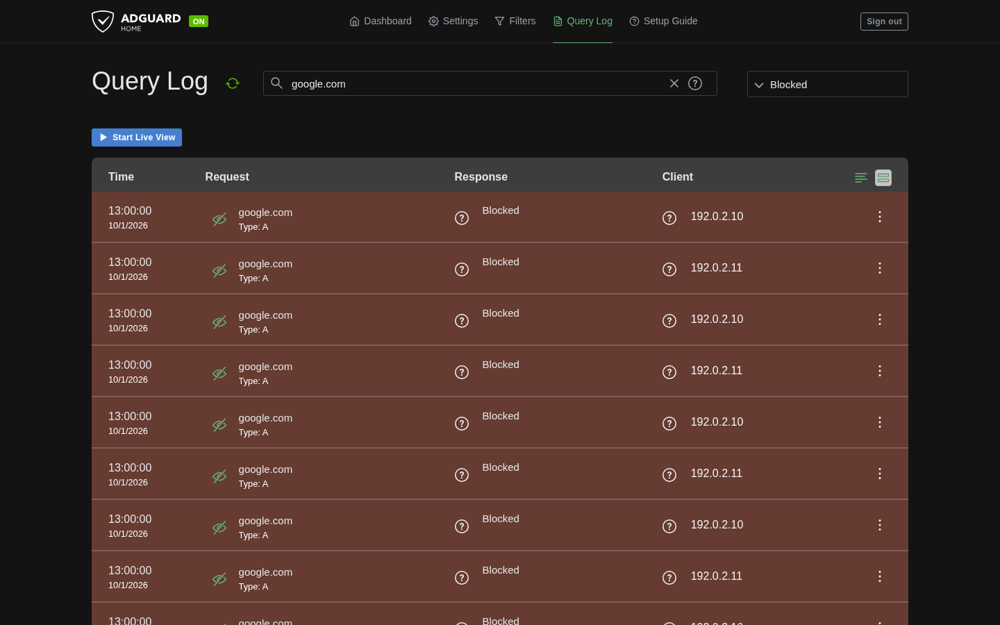
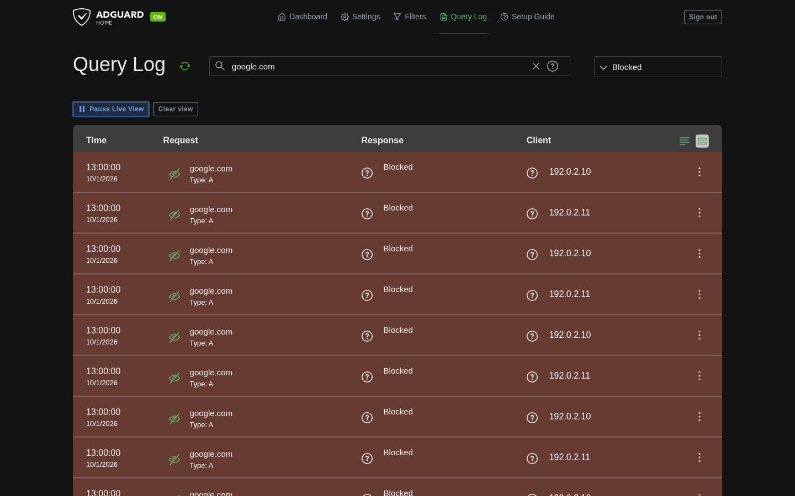
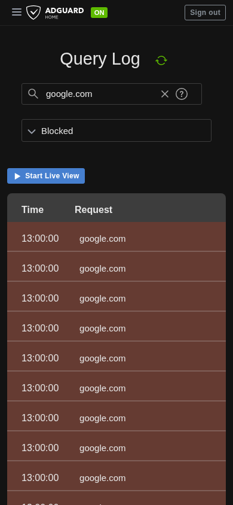
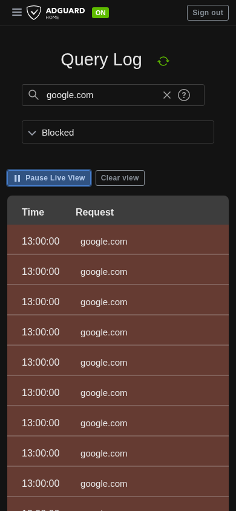
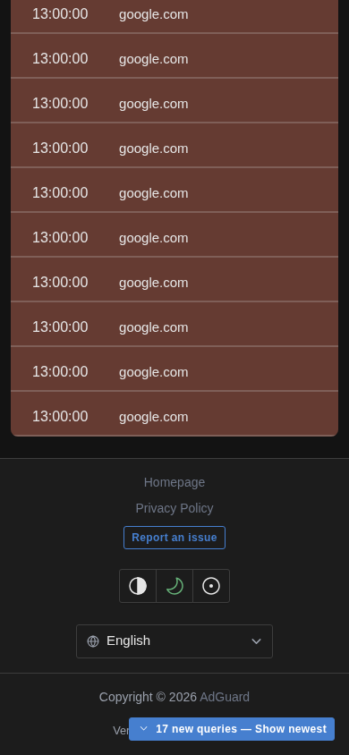

# Live Query Log controls

Click **Start Live View** to enable live polling. The blue start button becomes an outlined **Pause Live View** action; **Clear view** appears beside it as a secondary action. Clearing affects only the displayed browser view and keeps AdGuard Home's server Query Log/history, as explained by the button's tooltip and screen-reader description.

While reading older rows, new arrivals wait behind **17 new queries — Show newest**. Activating it reveals the queued queries and returns to the newest entries. The screenshots use sample blocked queries for `google.com`; the browser fixtures also use `microsoft.com` when validating filter changes.

These are visible-viewport captures of the production frontend from the existing browser harness, with deterministic API fixtures. Desktop is 1440 × 900; mobile is 390 × 844. The harness also checks the same states at 320 × 740, including action names, keyboard focus/activation, spacing, preference persistence, and queued arrivals through client block/unblock.

## Desktop, inactive

## Desktop, Live

## Mobile, inactive

## Mobile, Live

## Mobile, queued queries

